# Guided Determinism with Agent Script and Invocable Actions

> A practitioner's tutorial on building Agentforce agents that combine
> LLM flexibility with deterministic control flow. Built end-to-end from
> the `refund_support_agent` project: every concept, every diagram, every
> bug, and every fix is taken from real sessions.

---

## How to read this tutorial

The tutorial is organized as a journey, not a reference manual. Each
section builds on the one before it.

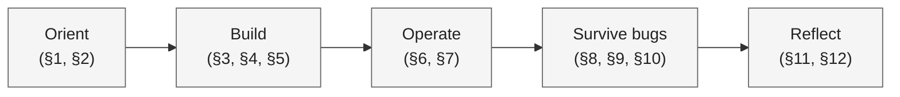

If you only have ten minutes, read §1 (the scenario), §3 (the four
control surfaces), and §10 (defense in depth). Those three sections
give you the central idea. The rest fills in mechanics, diagnosis, and
context.

### Table of contents

1. [The scenario](#1-the-scenario)
2. [Why this is hard](#2-why-this-is-hard)
3. [The mental model: four control surfaces](#3-the-mental-model-four-control-surfaces)
4. [Anatomy of a turn](#4-anatomy-of-a-turn)
5. [Invocable Apex: writing actions worth trusting](#5-invocable-apex-writing-actions-worth-trusting)
6. [The toolchain and the dev loop](#6-the-toolchain-and-the-dev-loop)
7. [Reading session traces](#7-reading-session-traces)
8. [Bug 1: the silent permission filter](#8-bug-1-the-silent-permission-filter)
9. [Bug 2: the planner that lies](#9-bug-2-the-planner-that-lies)
10. [Defense in depth](#10-defense-in-depth)
11. [The free-roam variant: when to relax](#11-the-free-roam-variant-when-to-relax)
12. [Where this fits in AI research](#12-where-this-fits-in-ai-research)
13. [Glossary](#13-glossary)
14. [Sticky-note appendix](#14-sticky-note-appendix)

---

## 1. The scenario

Every concept, code snippet, bug, and fix in this tutorial comes from one
concrete project: a customer-service refund agent for a fictional
company, **Acme Corp**. Read this section first.

### What the agent is supposed to do

A customer messages support, the agent walks them through a refund.
The end-to-end flow:

```
1. Customer asks for a refund.
2. Agent collects the customer's email and verifies them.
3. Agent looks up the order.
4. Agent confirms refund details with the customer.
5. Agent issues the refund and sends a confirmation.
```

It also handles edge cases: escalation to a human, off-topic questions,
and ambiguous intent.

### The five-topic graph

The agent is a small finite state machine. Each box is a `subagent` in
the `.agent` file.

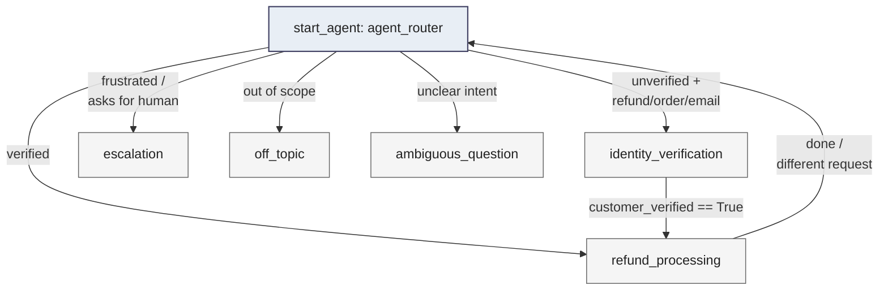

The router decides where each turn goes. Topics decide what to do once
they own the turn.

### The four backing Apex actions

| Apex class | Inputs | Outputs | Purpose |
|---|---|---|---|
| `VerifyCustomer` | `email` | `customer_id`, `verified` | Verify a customer by email |
| `FindOrder` | `order_id` | `order_status`, `order_amount`, `refundable_until` | Look up an invoice |
| `IssueReturn` | `order_id` | `refund_confirmation` | Issue the refund and return a code |
| `SendReply` | `reply_text` | `delivery_status` | Send the customer a final message |

These are real `@InvocableMethod` Apex classes deployed to the org.

### The variables we track across turns

```
customer_email        : ""              # the email the customer typed
customer_verified     : False           # the gate everything depends on
verified_flag         : ""              # raw "true"/"false" string from VerifyCustomer
customer_id           : ""              # e.g. "cust_100", only set if verified
order_id              : ""              # e.g. "INV-1007"
order_loaded          : False           # was FindOrder called yet?
order_status          : ""              # "paid", "refunded", "pending"
order_amount          : ""              # "$129.00"
refundable_until      : ""              # "2026-06-01"
refund_issued         : False
refund_confirmation   : ""              # "RFND-INV-1007-766349"
reply_sent            : False
```

These are the symbolic state. They make deterministic gating possible.

### A representative happy-path conversation

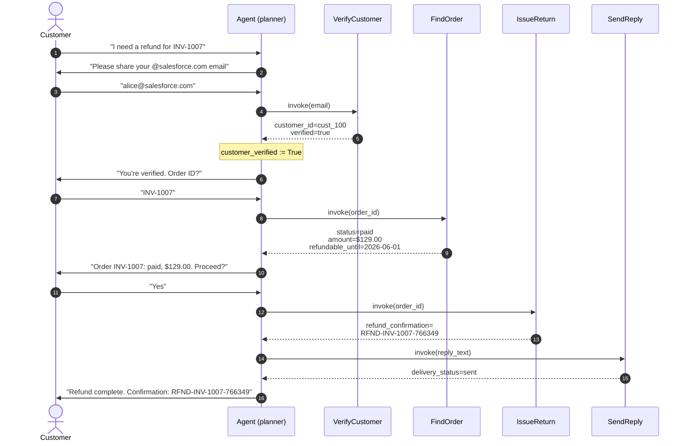

Every action call above is a real Apex invocation. Every variable
update along the way is visible in the session trace. This is what we
are building.

### A taste of the source

The `.agent` file's identity-verification topic, condensed:

```
subagent identity_verification:
    actions:
        verify_customer:
            target: "apex://VerifyCustomer"
            inputs:  { email: string }
            outputs:
                customer_id: string
                    description: "cust_NNN format. Empty means NOT verified."
                verified: string
                    description: "Literal 'true' or 'false' from Apex."

    reasoning:
        instructions: ->
            if @variables.customer_verified == False:
                | Goal: call verify with the customer's email. Ask for one if
                | you don't have it yet.
        actions:
            verify: @actions.verify_customer
                with email = ...
                set @variables.customer_id    = @outputs.customer_id
                set @variables.verified_flag  = @outputs.verified
            go_refund: @utils.transition to @subagent.refund_processing
                available when @variables.customer_verified == True

    after_reasoning:
        if @variables.verified_flag == "true":
            set @variables.customer_verified = True
```

And the matching Apex:

```apex
public with sharing class VerifyCustomer {
    public class ActionInput  { @InvocableVariable(required=true) public String email; }
    public class ActionOutput {
        @InvocableVariable public String customer_id;
        @InvocableVariable public String verified;
    }

    private static final Map<String,String> KNOWN_CUSTOMERS = new Map<String,String>{
        'alice@salesforce.com' => 'cust_100',
        'bob@salesforce.com'   => 'cust_101'
    };

    @InvocableMethod(label='Verify Customer')
    public static List<ActionOutput> invoke(List<ActionInput> inputs) {
        List<ActionOutput> results = new List<ActionOutput>();
        for (ActionInput inp : inputs) {
            ActionOutput out = new ActionOutput();
            String email = (inp.email == null ? '' : inp.email.trim().toLowerCase());
            if (KNOWN_CUSTOMERS.containsKey(email)) {
                out.customer_id = KNOWN_CUSTOMERS.get(email);
                out.verified    = 'true';
            } else {
                out.customer_id = '';
                out.verified    = 'false';
            }
            results.add(out);
        }
        return results;
    }
}
```

That is the full vocabulary. Topic graph, variables, Invocable Apex,
gates, traces, and one running example. We will refer back to these
snippets throughout.

---

## 2. Why this is hard

A naive agent is one of two extremes. Both fail.

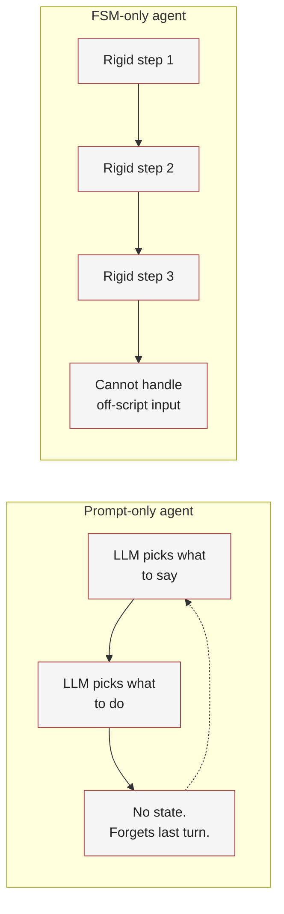

### Failure mode A: pure prompt, no structure

The model is told "verify the customer, then refund their order, then
send a reply." No actions are gated, no variables are tracked. What
happens:

- The model **narrates** instead of acting ("I'm verifying you now"
  but no Apex was called).
- The model **forgets** what state it is in across turns.
- The model **hallucinates** outputs ("Your customer ID is 12345" with
  no source).
- You cannot reliably enforce "must verify before refund."

### Failure mode B: pure deterministic, every turn scripted

Every transition is a hard `if`. What happens:

- The agent feels robotic and brittle.
- It cannot handle compound user input ("refund INV-1007, my email is
  alice@salesforce.com" with both pieces in one message).
- Adding a new edge case means adding another `if` branch.
- It cannot recover gracefully from off-script user phrasing.

### Key idea: guided determinism

> Use prompts where flexibility helps. Use deterministic gates where
> correctness matters. Never let the LLM decide whether the user is
> verified. Only Apex gets to make that call.

The pattern: the LLM picks *what to do next*. Deterministic gates
decide *what is allowed*. Backing actions decide *what is true*. Each
of those three sentences corresponds to a different control surface,
which the next section unpacks.

---

## 3. The mental model: four control surfaces

Agent Script gives you four orthogonal places to enforce behavior.
Knowing which to reach for first is the whole skill.

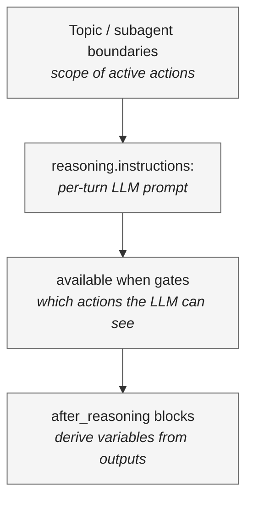

| Surface | What it controls | When to use |
|---|---|---|
| Topic / subagent boundaries | Which set of actions and instructions is "active" | Coarse phase changes (verification then refund) |
| `reasoning.instructions:` | What the LLM is told to do this turn | Soft guidance, multi-step plans, polite phrasing |
| `available when` gates | Which actions the LLM can even see | Hard constraints (no refund without verification) |
| `after_reasoning` blocks | Variable updates after an action runs | Compute derived state from action outputs |

### Worked example

```
subagent identity_verification:
    actions:
        verify_customer:
            target: "apex://VerifyCustomer"   # <- backing action (truth source)

    reasoning:
        instructions: ->                       # <- prompt (LLM-driven)
            if @variables.customer_verified == False:
                | Ask for an email if you don't have one. Otherwise call verify.
        actions:
            verify: @actions.verify_customer
            go_refund: @utils.transition to @subagent.refund_processing
                available when @variables.customer_verified == True   # <- gate

    after_reasoning:                           # <- derived state
        if @variables.verified_flag == "true":
            set @variables.customer_verified = True
```

Each line uses a different surface. The LLM is in charge inside
`instructions:` but cannot bypass `available when` or `after_reasoning`.

### Common pitfall

Trying to enforce a constraint in the prompt that should be a gate.
Saying "only call this action if X" in plain English is a hint, not a
guarantee. If correctness matters, add `available when @variables.X == True`.

---

## 4. Anatomy of a turn

What actually happens inside the planner each time the user types a
message?

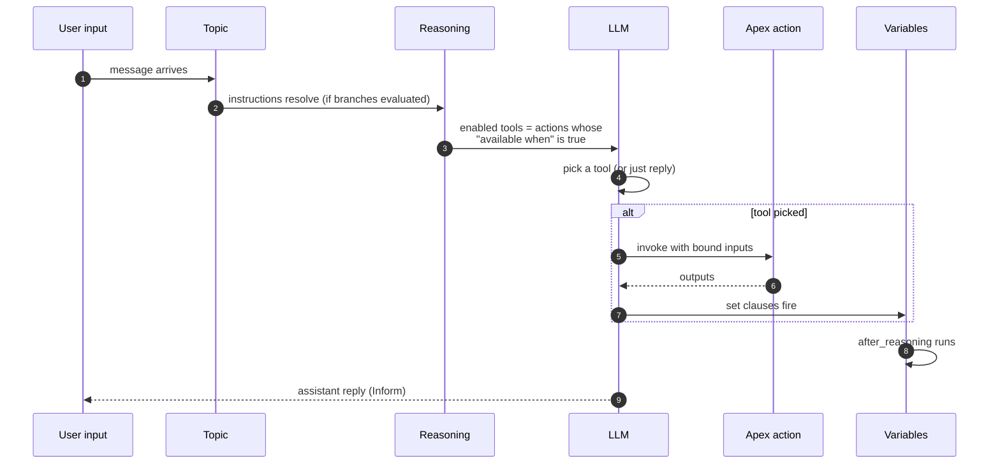

A few things to notice in this picture, because they explain almost
every bug later in the tutorial:

- The "enabled tools" list is computed *before* the LLM sees anything.
  If your action is missing from this list, the LLM cannot call it no
  matter how clear the prompt is.
- `set` clauses run on the LLM's report of what the action returned,
  not on a raw byte stream from Apex. This is the seam where
  hallucination enters (covered in §9).
- `after_reasoning` runs last and is fully deterministic. Use it to
  enforce invariants that the LLM should not be trusted to maintain.

### Two-level actions: definitions vs invocations

A subtle but crucial distinction.

- **Level 1 definitions** under `topic.actions:` declare *that an
  action exists* with a target, schema, and overall description.
- **Level 2 invocations** under `reasoning.actions:` declare *when and
  how to invoke it*: the description the LLM sees as a tool, slot-fill
  bindings, and where to write outputs.

```
actions:
    verify_customer:                            # Level 1 - definition
        target: "apex://VerifyCustomer"
        inputs: { email: string }
        outputs: { customer_id: string, verified: string }

reasoning:
    actions:
        verify: @actions.verify_customer        # Level 2 - invocation #1
            description: "Verify when user has provided an email"
            with email = ...
            set @variables.customer_id   = @outputs.customer_id
            set @variables.verified_flag = @outputs.verified

        revalidate: @actions.verify_customer    # Level 2 - invocation #2
            description: "Re-check verification mid-conversation"
            with email = @variables.customer_email
            available when @variables.suspect_session == True
```

One Apex class, two distinct planner-visible tools with different
gating. This is also why test specs assert against Level 2 names like
`verify`, not Level 1 names like `verify_customer`.

---

## 5. Invocable Apex: writing actions worth trusting

Backing actions are how the agent does anything real. The shape Agent
Script expects is **Invocable Apex** in three pieces:

```apex
public with sharing class VerifyCustomer {

    // 1. Input class. Every field is @InvocableVariable.
    public class ActionInput {
        @InvocableVariable(required=true)
        public String email;
    }

    // 2. Output class. Same pattern.
    public class ActionOutput {
        @InvocableVariable public String customer_id;
        @InvocableVariable public String verified;
    }

    // 3. The invoke method. Bulk shape: list-in, list-out.
    @InvocableMethod(label='Verify Customer'
        description='Verifies a customer by email...')
    public static List<ActionOutput> invoke(List<ActionInput> inputs) {
        List<ActionOutput> results = new List<ActionOutput>();
        for (ActionInput inp : inputs) {        // not `in` (reserved!)
            ActionOutput out = new ActionOutput();
            // ... real logic ...
            results.add(out);
        }
        return results;
    }
}
```

### The four rules

1. **Always bulk.** `List<Input>` to `List<Output>`. The framework
   passes one input at a time in practice, but the contract must be
   lists.
2. **Reserved names.** Loop variable cannot be `in` (Apex reserved
   keyword). `@InvocableVariable` field names cannot be `model`,
   `description`, or `label`.
3. **Truthful nulls.** Return `''` for "not found" and `'false'` for
   "no". Not `'stub_response'` or `'TODO'`. Placeholder strings cause
   *SMALL_TALK grounding* because the LLM falls back to its training
   prior when an output looks bogus.
4. **Deterministic.** Given the same input, return the same output.
   The planner caches and re-uses results in the same turn.

### Common pitfall: the auto-provision trap

We originally wrote:

```apex
} else if (KNOWN_CUSTOMERS.containsKey(email)) {
    out.customer_id = KNOWN_CUSTOMERS.get(email);
    out.verified = 'true';
} else {
    Integer hash = Math.abs(email.hashCode());
    out.customer_id = 'cust_' + Math.mod(hash, 800);  // auto-provision!
    out.verified = 'true';
}
```

For `info@salesforce.com` (not in `KNOWN_CUSTOMERS`), this happily
synthesized a fake customer ID and returned `verified=true`. **The
action was the source of truth, and it lied.** Fix: unknown emails
return `('', 'false')`. Always.

> Backing actions must be conservative. If they can lie even by accident,
> every defensive layer above them is built on sand.

---

## 6. The toolchain and the dev loop

Before we start hunting bugs in §8 to §10, you need to know the dev
loop. Every iteration is small.

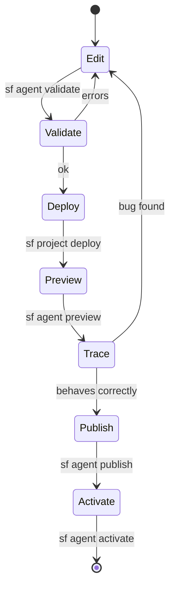

### Step 0: set the target org

```bash
sf config get target-org --json
# if empty:
sf config set target-org <alias>
```

### Step 1: edit the .agent file

4-space indents, booleans capitalized (`True`/`False`), strings
double-quoted. `with email = ...` means the LLM fills in.

### Step 2: validate compilation

```bash
sf agent validate authoring-bundle --json --api-name <api_name>
```

### Step 3: deploy backing Apex

```bash
sf project deploy start --json \
    --metadata ApexClass:VerifyCustomer
```

For each new class, also add it to the agent user's permission set
(see §8).

### Step 4: live preview against the bundle

```bash
SID=$(sf agent preview start --json --use-live-actions \
        --authoring-bundle <api_name> | jq -r .result.sessionId)

sf agent preview send --json --authoring-bundle <api_name> \
    --session-id $SID -u "<test utterance>"

sf agent preview end --json --authoring-bundle <api_name> --session-id $SID
```

`--use-live-actions` is essential. Without it, Apex is not actually
called, and you are testing the LLM rather than the system.

### Step 5: read traces

Covered in detail in §7. Briefly: the trace is a JSON file under
`.sfdx/agents/<api_name>/sessions/<sid>/traces/<plan_id>.json`.

### Step 6: publish and activate when green

```bash
sf agent publish authoring-bundle --json --api-name <api_name>
sf agent activate --json --api-name <api_name>
```

Every publish creates a permanent version. Do not publish during inner-
loop iteration. Only when you are happy with the build.

### Step 7: verify the published agent

Use `--api-name` (not `--authoring-bundle`) to test what end users
will hit:

```bash
sf agent preview start --json --api-name <api_name>
```

If behavior differs from `--authoring-bundle`, your published version
is older than your local edits.

---

## 7. Reading session traces

Traces are the single most useful debugging artifact. Every preview
session writes them to disk:

```
.sfdx/agents/<bundle_name>/sessions/<session_id>/traces/<plan_id>.json
```

A trace is an ordered list of typed steps. The handful that matter:

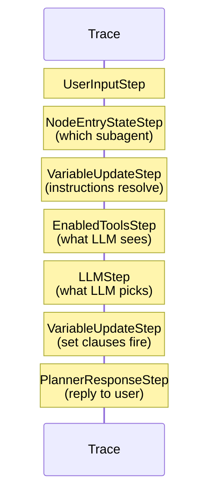

| Step type | What it answers |
|---|---|
| `UserInputStep` | What the user actually typed |
| `NodeEntryStateStep` | Which subagent the planner picked |
| `EnabledToolsStep` | Which actions the LLM could see this turn |
| `LLMStep` | What the LLM chose to do |
| `VariableUpdateStep` | How variables changed and why |
| `PlannerResponseStep` | The final reply to the user |

### Diagnostic recipes

**"My action isn't being called."** Find `EnabledToolsStep` for the
relevant topic. Is the action listed?
- Not listed: `available when` is too restrictive, or perms missing,
  or action not in `reasoning.actions:`.
- Listed but not called: action description does not match user
  intent enough. Tighten the description.

**"My variables are getting wrong values."** Find every
`VariableUpdateStep` for that variable. Note `directive_context`:
- `after_action`: came from `set` clauses or `after_reasoning`.
- `on_message`: came from `before_reasoning` or `start_agent`.

**"The agent stalled, replied without acting."** Look for `LLMStep`
that returned an `Inform` response with no preceding
`ActionInvocationStep`. The LLM chose to talk instead of act. Usually
the action description is unclear or `instructions:` does not tell
the LLM *when* to invoke vs. when to ask.

### Walking a trace in code

```python
import json
d = json.load(open('traces/<plan_id>.json'))
for s in d['plan']:
    t = s.get('type')
    if t == 'EnabledToolsStep':
        print(s['data']['agent_name'], '->', s['data']['enabled_tools'])
    elif t == 'VariableUpdateStep':
        for u in s['data']['variable_updates']:
            n = u['variable_name']
            if not n.startswith('__') and not n.startswith('AgentScriptInternal'):
                print(f"{n}: {u['variable_past_value']!r} -> "
                      f"{u['variable_new_value']!r} ({u['directive_context']})")
```

This 8-line script answered every "why did it do that?" question we had.

> If you take one habit away from this tutorial, it is this: never debug
> an Agent Script bug from the assistant's reply alone. Always look at
> the trace.

---

## 8. Bug 1: the silent permission filter

The single most painful bug in our build.

**Symptom:** the agent "thinks" but never invokes any action. Replies
like *"I am verifying your identity now"* with no action call. The
trace shows `enabled_tools: []` even though the action exists in
`reasoning.actions:`.

**Cause:** the agent runs as the **Einstein Agent User**, not as you
the admin. That user needs Apex class access on every action class.
Without it, the planner silently filters the action out of the LLM's
tool list.

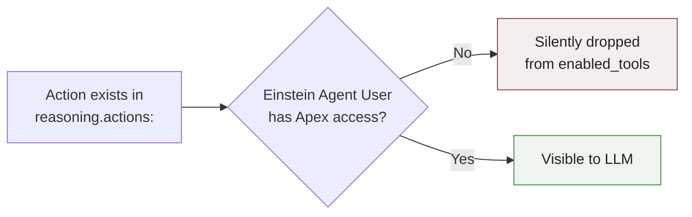

### Diagnosis query

```bash
sf data query --json -q "
    SELECT Id, SetupEntityId
    FROM SetupEntityAccess
    WHERE ParentId IN (
        SELECT PermissionSetId
        FROM PermissionSetAssignment
        WHERE Assignee.Username = 'coral_cloud_experience_agent...@example.com'
    )
    AND SetupEntityType = 'ApexClass'
    AND SetupEntityId IN (SELECT Id FROM ApexClass WHERE Name = 'VerifyCustomer')
"
```

If `totalSize: 0`, the agent user cannot see the class.

### Fix

```xml
<!-- force-app/main/default/permissionsets/RefundAgentActions.permissionset-meta.xml -->
<PermissionSet xmlns="http://soap.sforce.com/2006/04/metadata">
    <hasActivationRequired>false</hasActivationRequired>
    <label>Refund Agent Actions</label>
    <classAccesses>
        <apexClass>VerifyCustomer</apexClass>
        <enabled>true</enabled>
    </classAccesses>
    <!-- repeat for each backing class -->
</PermissionSet>
```

```bash
sf project deploy start --metadata "PermissionSet:RefundAgentActions"
sf org assign permset --name RefundAgentActions \
    --on-behalf-of <agent_user_username>
```

### Key idea: silent filtering

> The planner removes inaccessible actions from the tool list without
> raising an error. Always check `EnabledToolsStep` in the trace before
> assuming your code is wrong.

---

## 9. Bug 2: the planner that lies

This is the deepest insight from this build. **`@outputs.X` is what the
planner says the action returned, not what Apex literally returned.**
The LLM can summarize, paraphrase, or fabricate a tool result, and that
fabricated value becomes your variable's new value.

### A real example we hit

User typed: `"My email is info@salesforce.com"` (not a known customer).
Apex returned `customer_id="", verified="false"`. But the trace
showed:

```
verified_flag = "true"            # fabricated
customer_id   = "cust_100"        # alice's ID, the LLM had seen earlier
```

`after_reasoning` then saw `verified_flag == "true"` and flipped
`customer_verified = True`. **A non-customer was now verified.**

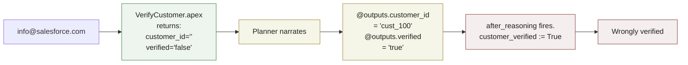

### Why this happens: three converging factors

1. **Sticky context.** The LLM has alice's `cust_100` in its
   conversation window from earlier turns and re-emits it.
2. **Vague output schema.** The action's `outputs:` block had no
   `description:` for the fields, so the LLM's prior is "a customer ID
   probably looks like `cust_100`."
3. **No raw-output enforcement.** Agent Script does not force
   `@outputs.X` to be the literal Apex return.

### Key idea: trust no narration

> Anywhere the LLM's view of an action output flows into a deterministic
> gate, you have a hallucination surface. The next section is the
> defensive playbook.

---

## 10. Defense in depth

There is no single setting that makes hallucination impossible. The
playbook is layers. Use as many as the stakes warrant.

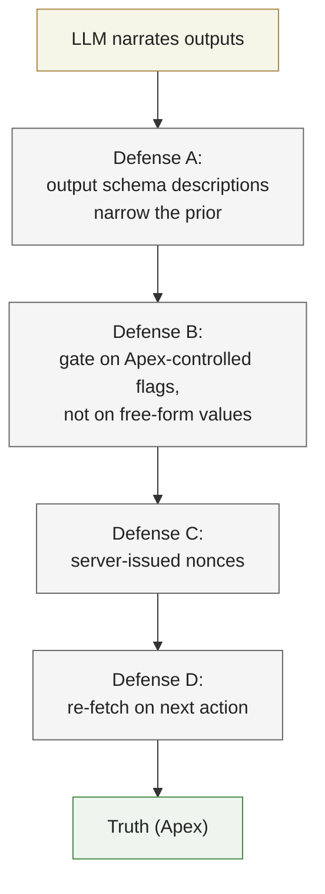

### Defense A: schema descriptions narrow the prior

```
outputs:
    customer_id: string
        description: "Customer ID in the format cust_NNN (e.g. cust_100).
            Empty string means NOT verified. Never invent a value, use
            only what Apex returns."
    verified: string
        description: "The literal lowercase string 'true' or 'false'
            returned by Apex. Only 'true' means verified."
```

### Defense B: gate on flags Apex controls, not on LLM-controlled values

Bad:
```
after_reasoning:
    if @variables.customer_id != "":          # any non-empty string passes
        set @variables.customer_verified = True
```

Better:
```
after_reasoning:
    if @variables.verified_flag == "true":
        set @variables.customer_verified = True
```

Best, because correlated values raise the bar for hallucination:
```
after_reasoning:
    if @variables.verified_flag == "true" and @variables.customer_id != "":
        set @variables.customer_verified = True
```

### Defense C: server-issued nonces

Have Apex return a one-time token like `"VRF-" + UUID`. The LLM has no
reason to invent a UUID-shaped string. Gate downstream actions on the
token's presence.

```apex
public class ActionOutput {
    @InvocableVariable public String customer_id;
    @InvocableVariable public String verified;
    @InvocableVariable public String verification_token;  // fresh per call
}
```

### Defense D: re-fetch on the next action

The next action down the pipeline (e.g. `FindOrder`) takes
`customer_id` and re-validates it server-side. A hallucinated
`cust_999` fails the lookup. This is the strongest defense because it
is implemented in Apex, not in the bundle.

### Cost vs benefit

| Defense | Effort | Spoof difficulty for LLM |
|---|---|---|
| A. Output descriptions | Trivial | Slightly harder |
| B. Apex-controlled flag gate | Small | Harder |
| C. Server nonces | Medium | Very hard |
| D. Server-side re-fetch | Medium-large | Effectively impossible |

Apply A and B unconditionally. Apply C and D anywhere the action
authorizes a downstream irreversible operation (refund, payment, data
release).

---

## 11. The free-roam variant: when to relax

Sometimes the deterministic `if` branches inside `instructions:` feel
heavy. We built a second variant of the same agent,
`refund_support_agent_free_roam`, where `identity_verification` has
*no* `if` branches in its prompt. Just one paragraph of plain English.

### Guided variant

```
reasoning:
    instructions: ->
        if @variables.customer_verified == True:
            | Customer {!@variables.customer_id} is verified.
            | Call go_refund now to move to refund processing.
        if @variables.customer_verified == False:
            | Goal: verify the customer by calling the verify action with their email.
            | If the user has provided an email, call verify with that email immediately.
            | If no email yet, ask for one.
```

### Free-roam variant

```
reasoning:
    instructions: ->
        | You are responsible for verifying the customer's identity before any
        | refund work happens. Your goal: end this turn with the customer
        | verified. To do that, you must call the verify action with the
        | customer's email address. Valid emails end with @salesforce.com.
        | When you do not yet have an email from the customer, ask them for one.
        | When the customer has provided an email, call the verify action.
        | After verification succeeds, hand control to refund processing
        | using the go_refund transition.
```

### What we observed

| Metric | Guided | Free-roam |
|---|---|---|
| Single-turn `"refund. alice@salesforce.com"` | verifies | verifies |
| Two-turn (split utterances) | asks then verifies | asks then verifies |
| Bad email like `bob@example.com` | declines | declines |
| Cost per turn | lower (smaller prompt) | higher (longer instructions) |
| Adversarial prompt-injection in this topic | predictable | varies more |
| Adding a 4th branch later | code change | prompt change |

### Key idea: free-roam is safe only because the gates are still there

The free-roam variant is safe **only because it inherits the same
`available when` gates and the same Apex backing action.** Free-roam
is a UX and cost trade-off. It does not relax correctness as long as
the deterministic surfaces stay intact.

> Relax prompts. Never relax gates.

---

## 12. Where this fits in AI research

Guided determinism is not a new idea. It is a productized point in a
well-studied design space. Naming the lineage helps you reason about
trade-offs others have already documented, reach for the right
research when easy fixes stop working, and avoid claiming inheritance
from research that does not actually apply.

### Key idea: the most accurate label is *neuro-symbolic*

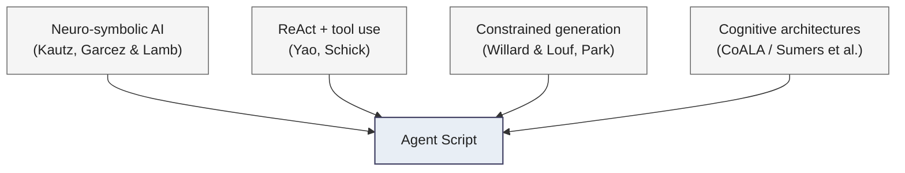

Agent Script combines a **symbolic scaffold** (FSM-like topic graph,
typed variables, `available when` predicates) with a **neural
decision-maker** (the LLM planner) and **typed external functions**
(Invocable Apex). That shape is the textbook definition of a neuro-
symbolic system in **Henry Kautz's six-category taxonomy**. It most
closely matches **Type 2: `Symbolic[Neuro]`**, "a symbolic problem
solver with a neural subroutine" (Kautz 2022).

### How it maps to the literature

#### 12.1 Neuro-symbolic AI: the primary frame

The defining manifesto is Garcez & Lamb, *Neurosymbolic AI: The 3rd
Wave* (arXiv:2012.05876, 2020). Their criterion for a neurosymbolic
system is "sound reasoning under the constraint of the symbolic
component while leveraging the learning capacity of the neural
component." That is exactly what `available when` does to an
otherwise unconstrained LLM. It enforces soundness at the action-
selection step.

Marcus 2020 (arXiv:2002.06177) argues neural systems need "explicit
symbolic machinery for manipulating variables, types, and structured
representations." Agent Script's typed variables, typed Invocable I/O,
and explicit FSM topic transitions are a direct embodiment of that
prescription.

The IJCAI/AAAI surveys converged on the term **"neuro-symbolic
integration"** (Sarker et al., arXiv:2105.05330, 2021). That is the
most defensible academic phrase if you write this up for an internal
review.

#### 12.2 Model-based agents: not the right label

In the Russell & Norvig sense (*Artificial Intelligence: A Modern
Approach*, 4th ed., 2020, Ch. 2), a "model-based agent" maintains
internal state. Agent Script's variables fit informally. But in the
**model-based RL** sense (Ha & Schmidhuber, *World Models*,
arXiv:1803.10122; Hafner et al., *Dreamer*, arXiv:1912.01603) you
need a *learned transition model*. Agent Script has none. Do not
claim that lineage. "Stateful agent" is fine. "Model-based agent"
overclaims.

The **BDI (Belief-Desire-Intention)** architecture (Rao & Georgeff,
ICMAS 1995) is a closer informal analogy. Variables resemble beliefs,
topic selection resembles intentions, `available when` resembles
context conditions on plans. But BDI is a metaphor here, not an
ancestor.

#### 12.3 LLM tool use and ReAct: the proximate engineering lineage

This is where the *implementation* genealogy lives.

- **Yao et al., *ReAct***
  (arXiv:2210.03629, ICLR 2023). The Thought, Action, Observation
  loop is the direct ancestor of any planner-picks-action / receive-
  typed-return-value architecture. The Agent Script preview-trace's
  `LLMStep` then `ActionInvocation` then `VariableUpdate` sequence is
  ReAct with stronger typing.
- **Schick et al., *Toolformer***
  (arXiv:2302.04761, NeurIPS 2023). Established typed external
  function calls as a first-class LLM primitive. Invocable Apex
  actions are the enterprise-typed analogue.
- **Huang et al., *Inner Monologue***
  (arXiv:2207.05608, CoRL 2022). Closed-loop feedback from
  environment state into the LLM planner, the precedent for variables
  flowing back into the planner via `after_reasoning`.

A defensible thesis: ReAct alone is not neurosymbolic. It is just LLM
plus tools. Adding `available when` gates over the action space is
what tips ReAct-style tool use into genuinely neurosymbolic territory,
because it imposes symbolic preconditions on the neural agent's choice
set.

#### 12.4 Constrained generation: the closest formal analogue to `available when`

- **Willard & Louf, *Efficient Guided Generation*** (arXiv:2307.09702,
  2023). The Outlines paper. Frames constrained generation as
  finite-state-machine masking of the LLM's output distribution.
  Almost literally Agent Script's topic FSM and action gating, lifted
  to the token level.
- **Park et al., *Grammar-Aligned Decoding*** (arXiv:2405.21047,
  NeurIPS 2024). Formalizes the distribution-distortion problem when
  you constrain an LLM to a grammar. Useful if you ever need to
  acknowledge gating has costs as well as benefits.
- **Beurer-Kellner et al., *Prompting Is Programming (LMQL)***
  (arXiv:2212.06094, PLDI 2023). The closest DSL-shaped precedent
  for Agent Script in academia.

#### 12.5 Cognitive architectures: the synthesis frame

**Sumers et al., *Cognitive Architectures for Language Agents (CoALA)***
(arXiv:2309.02427, TMLR 2024). CoALA explicitly frames LLM agents as
cognitive architectures with memory, action space, and decision
procedure. Drawing the line back to **Soar** (Laird, 2012) and
**ACT-R** (Anderson, 2007). Agent Script maps cleanly:

- Working memory ≈ Agent Script `variables`
- External action space ≈ Invocable Apex actions
- Decision procedure ≈ topic FSM + `available when` + LLM planner

If you need a single citation that legitimizes "Agent Script is a
cognitive architecture for an LLM agent," CoALA is it.

### Suggested defensible framing

If you are writing this up for an internal architectural review:

> "Agent Script is a *neuro-symbolic agent architecture* in the sense
> of Kautz (2022) and Garcez & Lamb (2020): a symbolic scaffold of
> finite-state topic graph, typed variables, and `available when`
> precondition gates wraps a neural planner (the LLM), with typed
> external functions (Invocable Apex) closing the loop in the style
> of ReAct (Yao et al., 2023) and Toolformer (Schick et al., 2023).
> The `available when` gates are conceptually a planner-level form
> of *constrained generation* (Willard & Louf, 2023; Park et al.,
> 2024), and the overall structure fits the *Cognitive Architectures
> for Language Agents* framework of Sumers et al. (2024)."

### Caveats

- **"Neurosymbolic" vs. "neuro-symbolic"**: Garcez/Lamb use
  "neurosymbolic". IJCAI/AAAI proceedings use "neuro-symbolic". Both
  are accepted. Pick one.
- **Contested**: whether ReAct alone is neurosymbolic. Yao et al. do
  not claim the label. Marcus-aligned authors would say it is not,
  because it lacks symbolic constraints over the action space.
- **Avoid**: calling it "model-based" in the RL sense. Avoid claiming
  Soar / ACT-R lineage directly. CoALA draws those analogies
  carefully. Do not overclaim.

### References

1. Kautz, H. "The Third AI Summer: AAAI Robert S. Engelmore Memorial
   Lecture." *AI Magazine* 43(1), 2022.
2. Garcez, A. d'A. & Lamb, L. C. "Neurosymbolic AI: The 3rd Wave."
   *Artificial Intelligence Review*, 2023. arXiv:2012.05876, 2020.
3. Sarker, M. K. et al. "Neuro-Symbolic Artificial Intelligence:
   Current Trends." arXiv:2105.05330, 2021.
4. Marcus, G. "The Next Decade in AI: Four Steps Towards Robust
   Artificial Intelligence." arXiv:2002.06177, 2020.
5. Yao, S. et al. "ReAct: Synergizing Reasoning and Acting in Language
   Models." *ICLR 2023*. arXiv:2210.03629.
6. Schick, T. et al. "Toolformer: Language Models Can Teach Themselves
   to Use Tools." *NeurIPS 2023*. arXiv:2302.04761.
7. Huang, W. et al. "Inner Monologue: Embodied Reasoning through
   Planning with Language Models." *CoRL 2022*. arXiv:2207.05608.
8. Willard, B. T. & Louf, R. "Efficient Guided Generation for Large
   Language Models." arXiv:2307.09702, 2023.
9. Park, K. et al. "Grammar-Aligned Decoding." *NeurIPS 2024*.
   arXiv:2405.21047.
10. Beurer-Kellner, L. et al. "Prompting Is Programming: A Query
    Language for Large Language Models (LMQL)." *PLDI 2023*.
    arXiv:2212.06094.
11. Sumers, T. R., Yao, S., Narasimhan, K. & Griffiths, T. L.
    "Cognitive Architectures for Language Agents." *TMLR 2024*.
    arXiv:2309.02427.
12. Russell, S. & Norvig, P. *Artificial Intelligence: A Modern
    Approach*, 4th ed., Pearson, 2020.

---

## 13. Glossary

- **Agent Script**: the DSL inside `.agent` files. Indentation-
  sensitive, not YAML.
- **Bundle / AiAuthoringBundle**: the metadata wrapper holding a
  `.agent` file plus a `bundle-meta.xml`.
- **Topic / subagent**: a named scope holding instructions, actions,
  and state. The planner is "in" exactly one at a time.
- **Action target**: the URI string identifying the backing logic.
  `apex://ClassName`, `flow://FlowApiName`, `prompt://TemplateName`.
- **Invocable**: Apex annotated with `@InvocableMethod` and
  `@InvocableVariable`. List-in / list-out shape required.
- **Level 1 vs Level 2 actions**: definition (target + schema) vs.
  invocation (when + bindings).
- **`with X = ...`**: slot-fill. The LLM extracts X from conversation.
- **`with X = @variables.Y`**: direct binding. Deterministic.
- **`available when <expr>`**: visibility gate. The action is hidden
  from the LLM when the expression is false.
- **`set @variables.X = @outputs.Y`**: capture an action output to a
  variable. Captures whatever the planner reports the output to be.
- **`after_reasoning:`**: post-action deterministic state update block.
- **`@system_variables.user_input`**: the raw current user message.
- **Einstein Agent User**: the running user the planner executes as.
  Needs permset access to every Apex class your actions target.
- **Trace / `plan_id.json`**: the per-turn JSON record of every step
  the planner took. The single most useful debugging artifact.
- **Neuro-symbolic / Type-2 hybrid**: Kautz's category for systems
  where a symbolic problem solver invokes a neural subroutine. Agent
  Script's closest formal home in the literature.
- **Constrained generation / guided generation**: research line on
  restricting LLM output to a grammar or FSM. The closest formal
  analogue to how `available when` shapes the LLM's tool-choice
  distribution.

---

## 14. Sticky-note appendix

The seven things we wish we had known on day one:

1. **The agent runs as a different user.** Permission-set every Apex
   class.
2. **Stubs that return `'stub_response'` poison the planner.** Return
   real data or `''`/`'false'`.
3. **`enabled_tools` in the trace is the truth** about what the LLM
   sees.
4. **`@outputs.X` is what the planner *says* Apex returned.** Defend
   against it lying with descriptions, flag-based gates, and
   correlated checks.
5. **The reserved Apex word `in` will silently break your loop.**
   Use `inp`.
6. **`if @variables.customer_id != ""` is a dangerously loose gate.**
   Any non-empty hallucination passes it. Gate on explicit flags from
   Apex.
7. **`--use-live-actions` is mandatory** when iterating against real
   backing logic. Without it, you are testing the LLM, not the system.
